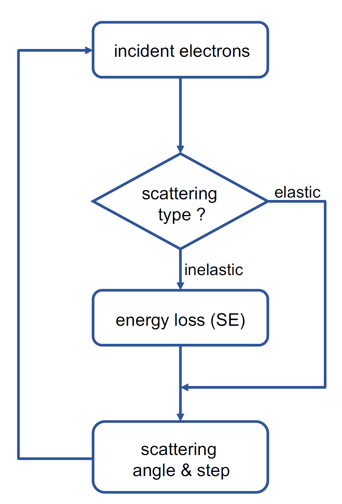

# Electron-black-body-simulation

## Table of contents

* [Introduction](#Introduction)
* [Requirement](#Requirement)
* [Usage](#Usage)

## Introduction

The project provides the source code of simulation used in the [letter](https://www.pnas.org/doi/10.1073/pnas.2209670120).  More information about the algorithm could be found in the Appendix file and the [article](https://aip.scitation.org/doi/10.1063/1.3033564). The project mainly contains three parts: elastic scattering, inelastic scattering and the Monte Carlo calculation. The basic progress could be summarized as the following flowchart.



## Requirement

The project is based on [Python 3.6](https://www.python.org/) 3.6 and we recommend to use [Anaconda](https://www.anaconda.com/) to create corresponding python environment.  The packages used by the project contains

* [NumPy](https://numpy.org/), 1.19.2 or later
* [SciPy](https://scipy.org/),1.5.2 or later
* [Matplotlib](https://matplotlib.org/),3.3.4 or later
* [Numba](https://numba.pydata.org/), 0.53.1 or later

The program is tested on windows 10 system, and with Intel(R) Xeon(R) CPU E5-2699 v3 and 256GB RAM. The RAM requirement could be modified by changing the n_pool parameter in the simu_ac_** file, but not lower than 8GB.


##Usage

As mentioned above, the MC progress requires databases of both the elastic scattering progress and inelastic scattering progress. Both of them could be download from Tsinghua cloud https://cloud.tsinghua.edu.cn/d/15d943540f58496992a9/. Then just copy the 'database' folder in your project path. If you want to build the databases by yourself, make a new folder and name it as 'database'. Then every material could be added by create a new folder and add corresponding elastic and inelastic scattering database file.

### Material properties

The material properties could be modified in the 'YourProjectPath/material/material.py' file. **Make sure** that, before create your own database, the information of material has been correctly added in the file. Besides, if you want to calculate the elastic scattering cross section of new elements, add the correct information in ''YourProjectPath/elastic/tfd.py' file.

### Elastic Database

The elastic scattering part has adopted the TFD model and the element number could be changed by 'Ze' parameter in  'YourProjectPath/elastic/elastic.py file'. Make sure that the anaconda environment has been activated and then run

```
python YourProjectPath/elastic/elastic.py
```

Then the 'sigma.npy' and 'PE.npy' files would be generated. Then run

```
python YourProjectPath/elastic/inte_sc.py
```

Copy the generated 'elastic_mfp.npy' and 'elastic_sc.npy' to  'YourProjectPath/database/YourMaterial/elastic' folder.

### Inelastic Database

The inelastic scattering part requires material data from experiment. The data used in the [letter](https://www.pnas.org/doi/10.1073/pnas.2209670120) has been provided in the project. Modify the corresponding parameters in 'YourProjectPath/inelastic/FPA.py' and 'YourProjectPath/inelastic/inelastic.py'. To generate inelastic database, make sure that the anaconda environment has been activated and then run

```
python YourProjectPath/inelastic/FPA.py
```

Then run

```
python YourProjectPath/inelastic/inte_sc.py
```

Enter '0' and you would get 'inelastic_mfp.npy' file. Then run 'inte_sc.py' file again and enter '1' and '2', to get 'inelastic_le.npy' and 'inelastic_sc.npy' separately. Then copy all the generated files to 'YourProjectPath/database/YourMaterial/inelastic' folder.

### Monte Carlo Simulation

Once one has built the database of the target material,  it would be easy to run the MC program by running

```
python YourProjectPath/simu_ac_cross.py
```

The given parameter, with 32 pools and $10^5$ incident electrons, may be adjusted by your own computer.
